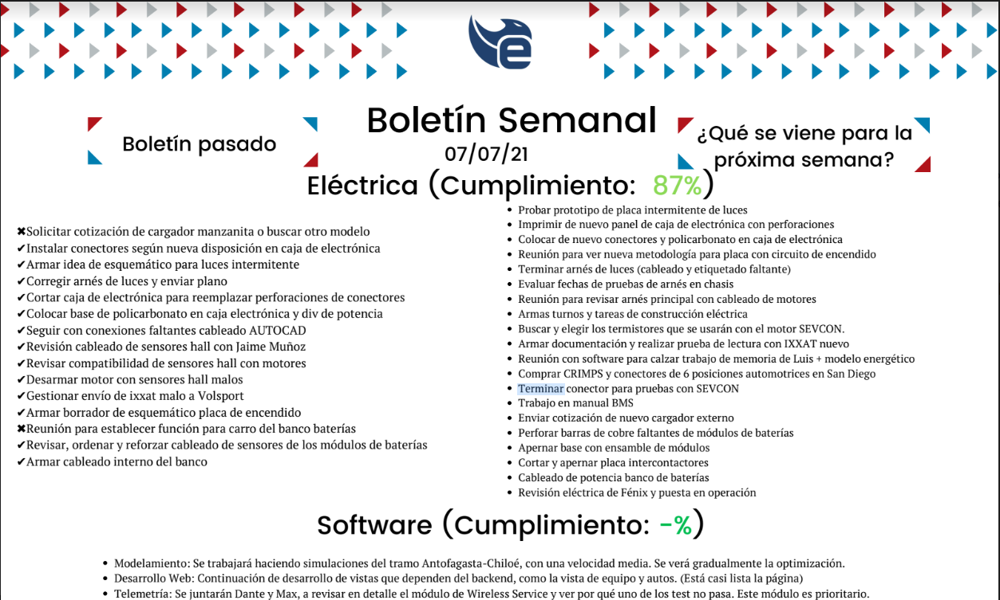
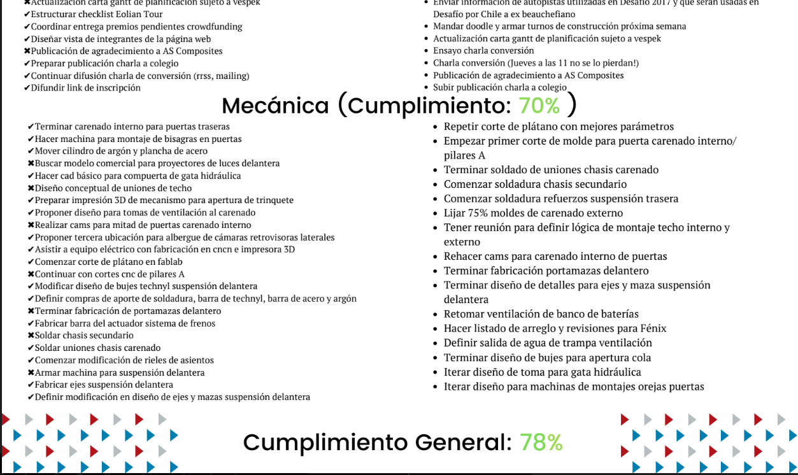

# Boletin semanal de avances

El objetivo de este proyecto es revivir el boletín de tareas semanales que existió hace un tiempo.

Nace la motivación de revivir el boletín para el equipo y para los ex integrantes.

## TODO:

* Hacer el header y footer del boletin original.
* Hacer un filtro para las semanas.
* Hacer una guía para que cualquier persona pueda actualizar las tareas semana a semana.
* Evaluar una mejor forma de manejar las tareas.
